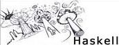

# Haskell Resources

A collection of resources useful for learning haskell programming

## [Learn You a Haskell](http://learnyouahaskell.com/)

By far the best introduction to Haskell.  

The simple explanations and smiley doodles make the experience much less painful.  

(Though it does little to dissuade the rumours that all Haskell programmers get their skill by ingesting psilocybin mushrooms.)

## [Parser Combinators: Parsing for Haskell Beginners](https://two-wrongs.com/parser-combinators-parsing-for-haskell-beginners.html)

A very easy introduction to parser combinators, with a comparison to an equivalent regex.  
